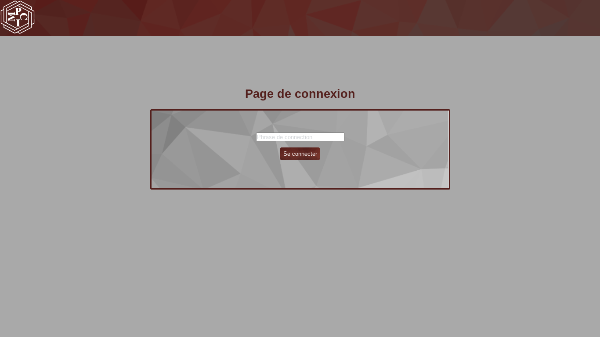
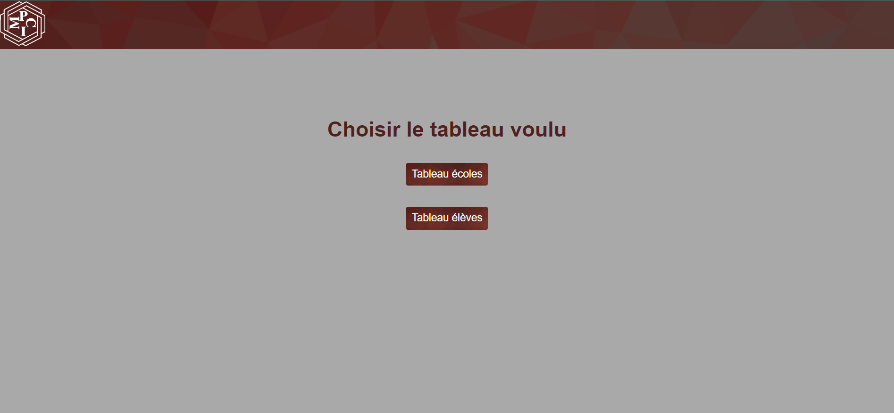
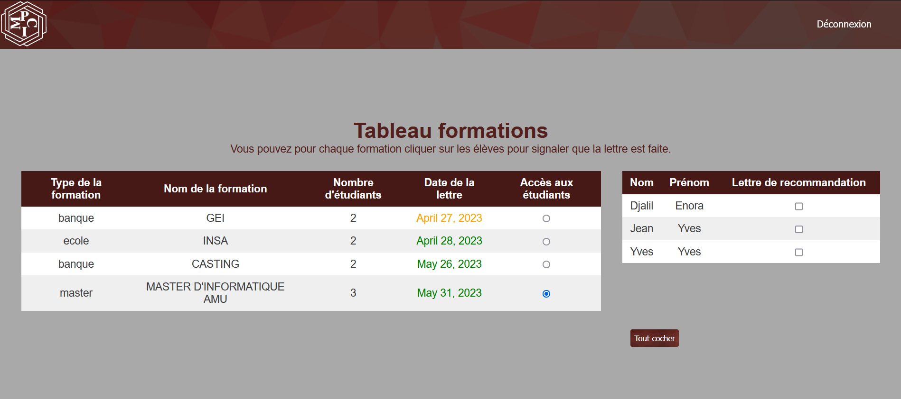
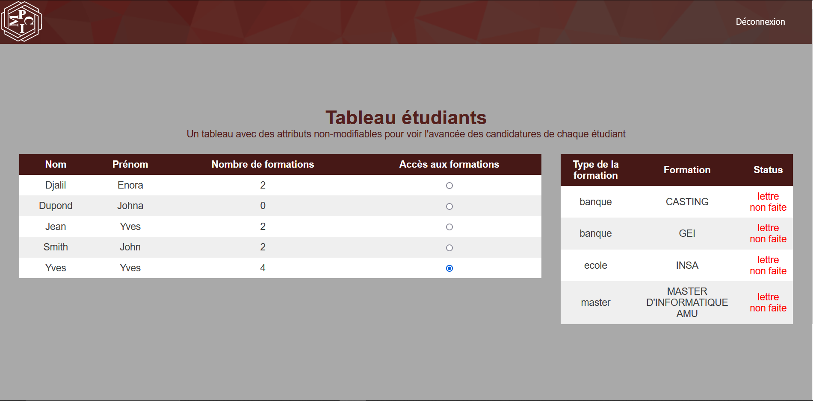
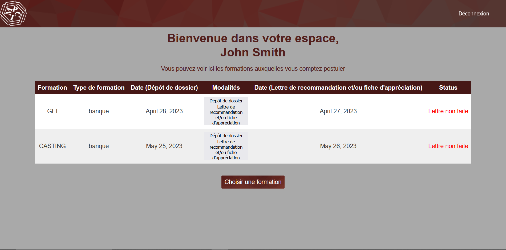
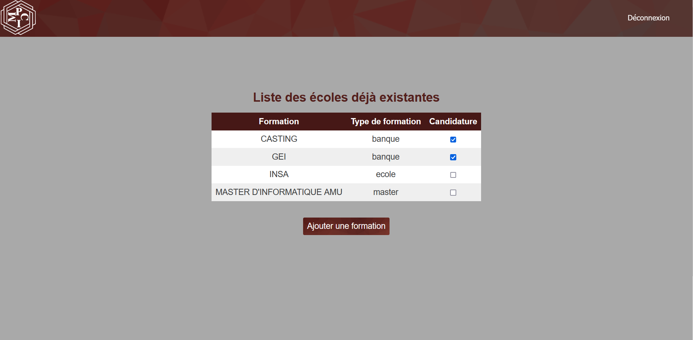
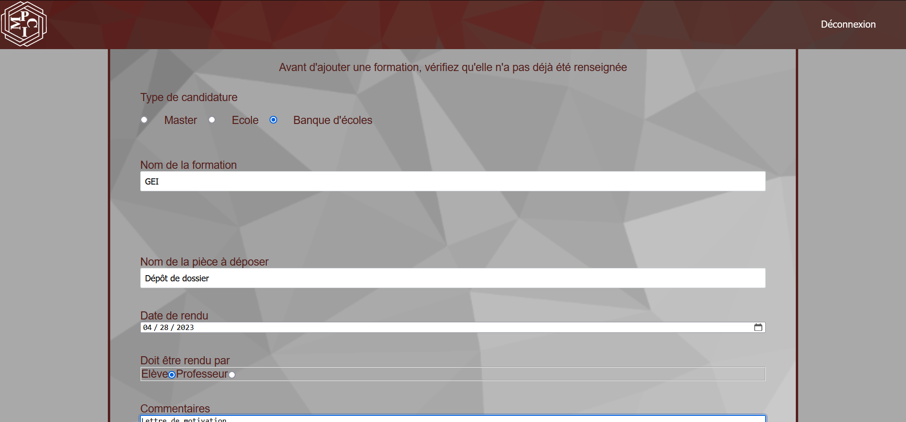

# Utilisation du site

Deux types d'utilisateurs peuvent l'utiliser : le responsable et les étudiants. Ils peuvent se connecter via la page de connexion suivante :

## Utilisation par le responsable

### Accueil

Une fois connecté, le responsable arrive sur une page qui lui donne accès à deux tableaux : le tableau étudiants et le tableau formations.

### Tableau formations

S'il va sur le tableau formations, il arrive sur une page où il peut voir les formations rangées par date de remise des lettres de recommandation croissant, afin de voir en priorité les lettres les plus urgentes à écrire. Il peut voir les modalités de rendu et les étudiants ayant candidaté. il peut spécifier si une lettre a été rédigée ou non.

### Tableau étudiants

S'il va sur le tableau étudiants, il peut voir quel élève a postulé à quelles formations, afin de vérifier si l'étudiant a postulé à des formations qui correspondent à son projet professionnel. Il peut également voir si il a fait les elttres ou non.

## Utilisation par un étudiant

### Accueil : liste des écoles déjà choisies

En se connectant, l'étudiant arrive sur une page lui montreant les formations pour lesquelles il a postulé rangées par ordre de rendu des dossiers.

### Ajout d'une école dans la liste des écoles auxquelles l'étudiant postule

Pour arriver sur cette page, l'étudiant doit cliquer sur le bouton "obtenir une formation" en bas de la page précédente. Une liste contenant toutes les écoles présentes dans le base de données est affichée, et l'étudiant peut ajouter une formations à sa liste en cochant la case en face du nom de la formation voulue.

### Compléter la base de données

Si l'école n'est pas dans la base de données, l'étudiant peut l'ajouter en cliquant sur le bouton "ajouter une formation". Il doit alors remplir le formulaire qui s'y affiche. Certains champs sont déjà remplis et non modifiables. La section "Commentaires" permet de spécifier par exemple les pièces à déposer lors du dépôt de dossier, ou encore l'endroit où il faut déposer les lettres de recommandation. Le destinataire désigne la personne qui est concernée par ce dépôt de pièces.

